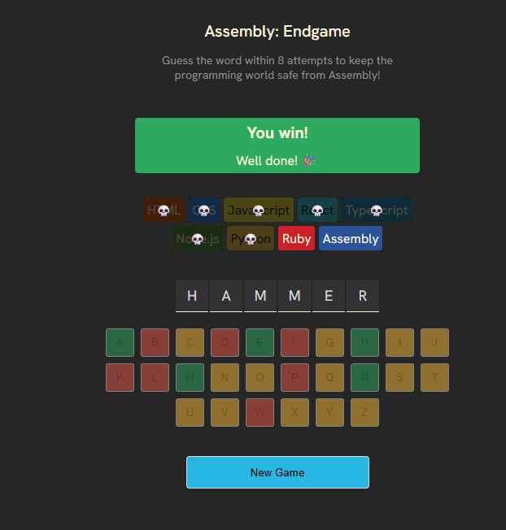

# Assembly: Endgame

A fun word-guessing game where you must guess the word correctly to save programming languages from Assembly!



## 🎮 Game Overview

In Assembly: Endgame, you're tasked with saving the programming world from Assembly language taking over. For each incorrect guess, one of your favorite programming languages will disappear forever! Can you guess the word before Assembly becomes the only language left?

- 🎯 Guess the hidden word letter by letter
- 🚫 Each incorrect guess eliminates a programming language
- 🏆 Win by completing the word before Assembly becomes the only language left
- 💀 Lose by making too many incorrect guesses

## 🛠️ Technologies Used

- React 19
- Vite
- JavaScript
- CSS
- clsx

## 🚀 Getting Started

### Prerequisites

- Node.js (version 18.0.0 or higher recommended)
- npm (version 9.0.0 or higher recommended)

### Installation

1. Clone the repository:
   ```bash
   git clone https://github.com/yourusername/assembly-endgame.git
   cd assembly-endgame
   ```

2. Install dependencies:
   ```bash
   npm install
   ```

3. Start the development server:
   ```bash
   npm run dev
   ```

4. Open your browser and navigate to:
   ```
   http://localhost:5173
   ```

## 📝 How to Play

1. A random word will be chosen at the start of the game
2. Click on letters on the keyboard to make guesses
3. Correct guesses will reveal the letter in the word
4. Incorrect guesses will eliminate a programming language
5. Win by revealing the entire word before losing all languages
6. Lose if you make 8 incorrect guesses (all languages except Assembly are eliminated)
7. Click "New Game" to start a new round after the game ends

## 🏗️ Project Structure

```
assembly-endgame/
├── public/
├── src/
│   ├── App.jsx          # Main game component
│   ├── languages.js     # Programming languages data
│   ├── utils.js         # Utility functions
│   ├── words.js         # Word list for the game
│   ├── main.jsx         # Entry point
│   └── index.css        # Global styles
├── index.html
├── package.json
├── vite.config.js
└── README.md
```

## 🧩 Features

- Responsive design that works on mobile and desktop
- Visual feedback for correct and incorrect guesses
- Fun animations and confetti when you win
- Accessible design with screen reader support
- Randomly selected words for replayability
- Clever farewell messages when languages are eliminated

## 📋 Available Scripts

- `npm run dev` - Start the development server
- `npm run build` - Build the app for production
- `npm run lint` - Run ESLint to check for code issues
- `npm run preview` - Preview the production build locally

## 🔮 Future Improvements

- Add difficulty levels with different word lengths
- Create a high score leaderboard
- Add sound effects and background music
- Implement themes for different programming domains
- Add multiplayer support

## 📄 License

This project is licensed under the MIT License - see the [LICENSE](LICENSE) file for details.

## 👏 Acknowledgments

- Created by David McCullough
- Word list curated from common English words
- Programming language selection inspired by popular languages
- Special thanks to contributors and testers

---

Made with ❤️ by [David McCullough](https://github.com/yourusername)
